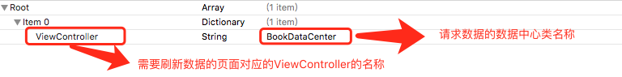

# AutoRefresher


## 简介
AutoRefresher根据设定的时间间隔定时自动刷新指定的数据，并通知指定的页面更新数据；刷新哪些数据以及哪些页面需要更新数据等配置通过plist文件统一管理 

只需使用**ARefresher**类完成所有操作：
* 设置刷新时间：`setPlistPath`
*  设置位置文件路径：`setPlistPath`
*  设置服务器主机名称：`setSeverHost`
*  开启自动刷新：`start`
*  停止自动刷新：`stop`

## 使用
* 将AutoRefresher文件夹拷贝到工程
* 创建plist配置文件，格式如下

* 配置文件中的ViewController类实现ARProtocol协议 
```swift
/**
     获取请求参数
     - parameter dcClass: 数据中心类型
     - returns: 参数字典，key为参数名，value为参数值
     */
    func requestParam(_ dcClass:AnyClass) -> [String:AnyObject]
    
    /**
     更新数据
     - parameter data: 新数据
     - parameter fromDC: 产生新数据的数据中心类型
     - returns: 无
     */
    func updateData(_ data:AnyObject,fromDC:AnyClass) -> Void
```
* 创建配置文件中的数据中心类实现ARDCProtocol协议
```swift
/**
     加载数据
     - parameter params:   参数字典，key为参数名，value为参数值
     - parameter complete: 加载成功后的回调
     */
    func loadData(_ params:[String:AnyObject], complete:((Bool,String?),AnyObject)->Void)
```
* 在AppDelegate中通过ARefresher设置`刷新时间间隔`、`服务器主机名`、`配置文件路径`，并启动自动刷新
```swift
func application(_ application: UIApplication, didFinishLaunchingWithOptions launchOptions: [UIApplicationLaunchOptionsKey: Any]?) -> Bool {
         ARefresher.sharedInstance.setPlistPath(Bundle.main.path(forResource: "AutoRefreshConfig", ofType: "plist")!).setRefreshTime(5.0).setSeverHost("baidu.com").start()
        return true
    }
```
